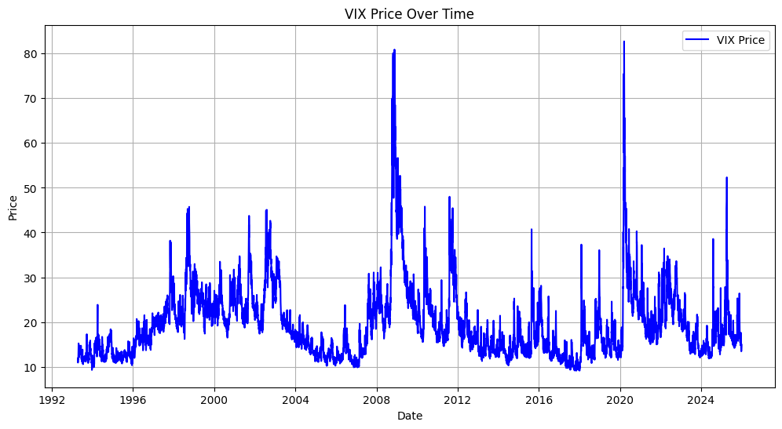
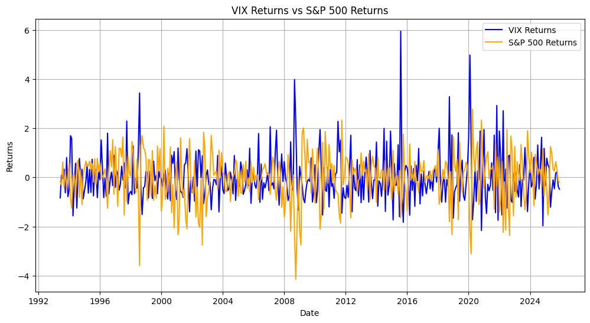
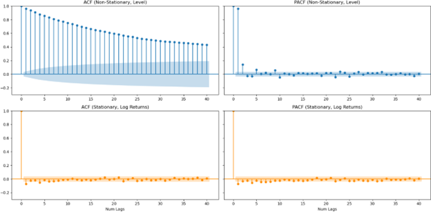

## Abstract

The Volitility Index, or VIX, has for decades been used as a gauge for market volatility; it is colloquially known as the "fear index," for it is quite correlated with fear in the financial markets.

The VIX is inversely correlated with the broader market returns: when the market goes up, the VIX tends to fall. Conversely, when the market sharply downturns, the VIX tends to shoot up, hence the term "VIX spike." Looking at the plot above, you see VIX spikes during time of macroeconomic instability: The 2008 Financial Crisis, COVID in 2020, Tariff uncertainty in 2025, among other things.

{fig-align="center"}

## Data Cleaning & EDA

{fig-align="center"}

## Feature Engineering & Selection

## SARIMAX Model

## RNN Model

## Preliminary Comparisons

## Early Conclusions