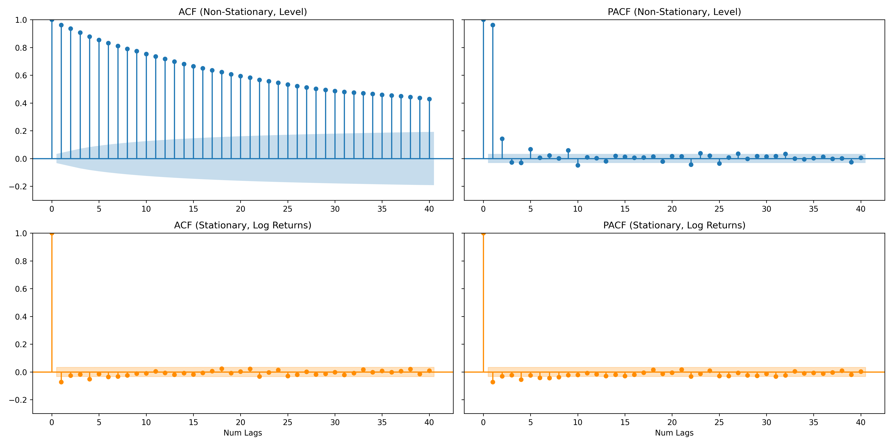
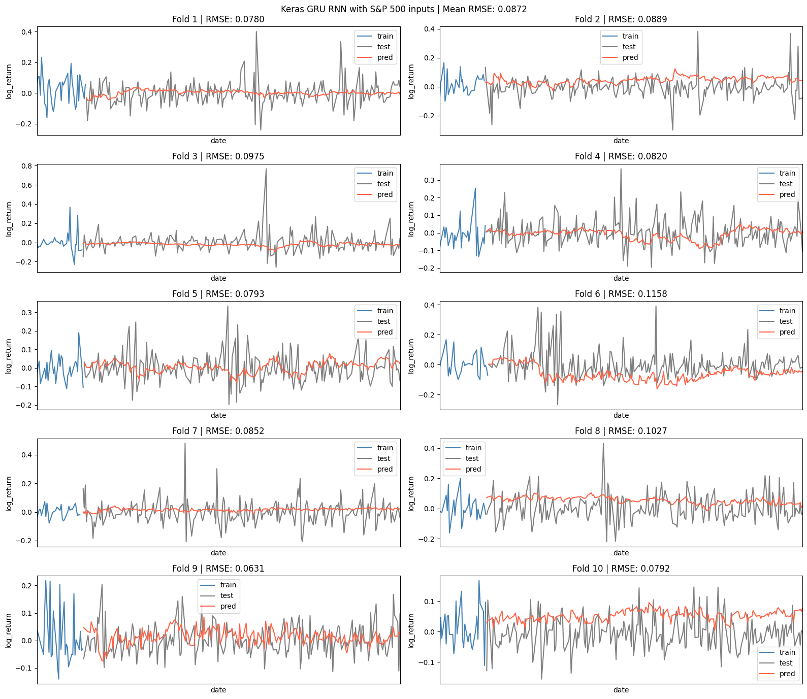
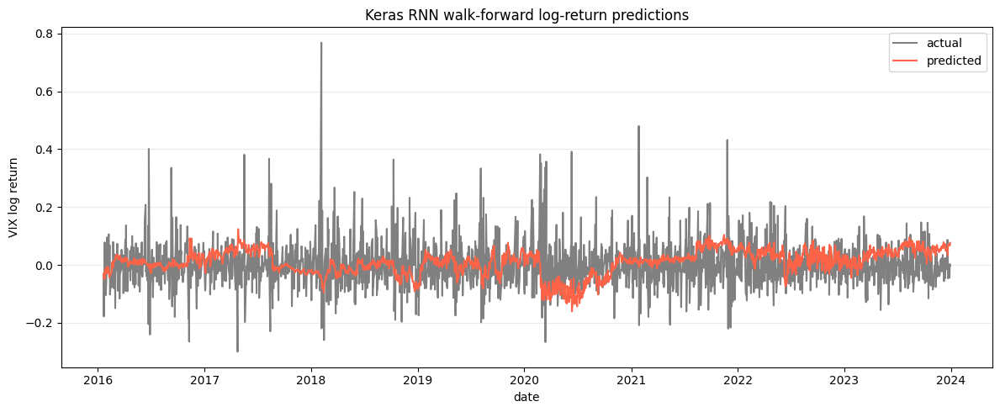
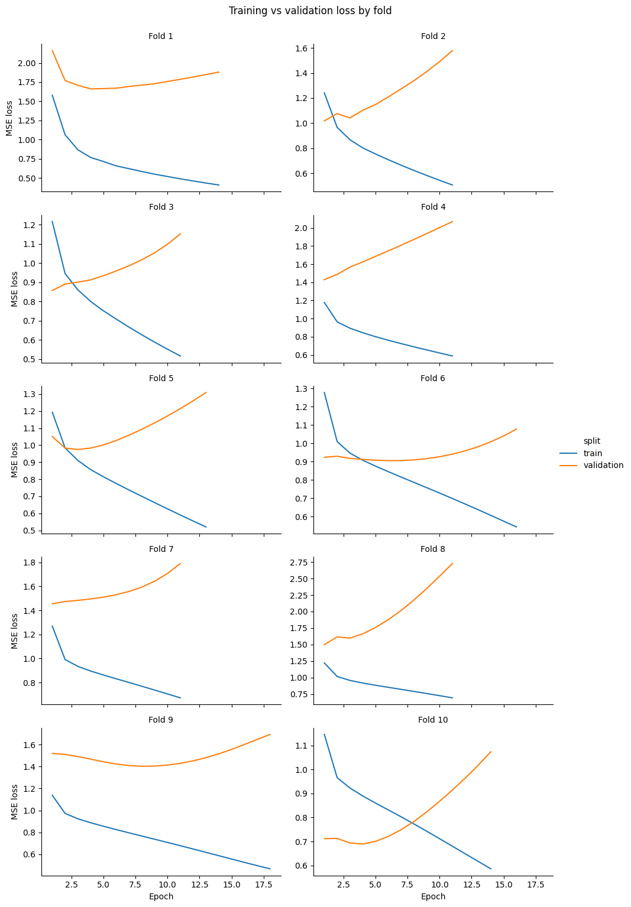

## Data cleaning and EDA

The Volatility Index, or VIX, has for decades been used as a gauge for market volatility; it is colloquially known as the "fear index," because it is strongly connected to fear in the financial markets. It measures the 30-day implied volatility of SPX options, where SPX is the S&P 500 index.

{fig-align="center" width="500"}

The VIX is inversely correlated with the broader market returns (`r=-.71`, `p<.001` between 1993 and 2026 for monthly returns): when the market goes up, the VIX tends to fall. Conversely, when the market sharply downturns, the VIX tends to shoot up, hence the term "VIX spike." Looking at the plot above, you see VIX spikes during times of macroeconomic instability: The 2008 Financial Crisis, COVID in 2020, tariff uncertainty in 2025, among other things. Looking at the plot below illustrates the contrast between the VIX and the S&P 500, visually indicating that the monthly S&P 500 returns tend to oppose monthly VIX returns.

{fig-align="center" width="500"}

We will use the following data for our analysis: 1. Reddit comments from r/wallstreetbets, analyzed for sentiment using roBERTa, an NLP model. 2. S&P 500 daily returns. 3. Geopolitical Risk Index data, which tracks the frequency of adverse geopolitical events as reported in 10 large newspapers. Using this data, **we will predict daily VIX log returns**.

{fig-align="center" width="500"}

Figure 3 shows the autocorrelation (left) and partial autocorrelation (right) of the VIX and VIX log returns. The figure indicates that the VIX is dependent on the days that come before it, especially the previous day.  However, the log returns show much weaker evidence of autocorrelation.

The cleaned modeling table is built by aligning observations by date, sorting chronologically, and dropping rows where merged sources or engineered lags are unavailable. The target is close-to-close VIX log return, and all exogenous variables used for prediction are shifted or lagged so the models only use information available before the close being predicted.

### SARIMAX data load and merge

```{python}
#| include: false
%pip install numpy optuna pandas yahooquery scikit-learn statsmodels seaborn matplotlib
import warnings

warnings.filterwarnings("ignore")

import numpy as np
import optuna
import pandas as pd
import yahooquery as yq
from sklearn.metrics import root_mean_squared_error
from statsmodels.tsa.statespace.sarimax import SARIMAX
from sklearn.model_selection import TimeSeriesSplit
import seaborn as sns
import matplotlib.pyplot as plt
from statsmodels.tsa.stattools import adfuller
from statsmodels.tsa.stattools import grangercausalitytests
from statsmodels.stats.diagnostic import het_arch
```

The SARIMAX workflow starts with two daily data sources:

1.  [Geopolitical Risk Index](https://www.matteoiacoviello.com/gpr.htm)
2.  Volatility Index (VIX)

```{python}
gpr_df = pd.read_stata("../data/gpr_daily.dta",
                       columns=["date", "GPRD", "GPRD_ACT", "GPRD_THREAT"])
gpr_df.head()
```

```{python}
vix = yq.Ticker("^VIX").history(interval="1d", start="2012-01-01", end="2026-01-01").reset_index()
vix["date"] = pd.to_datetime(vix["date"])
vix = vix.drop(columns=["symbol", "open", "high", "low", "close", "volume"])
vix.head()
```

```{python}
# merge vix and gpr
df = vix \
    .merge(gpr_df, on="date", how="left") \
    .dropna()
df = df.sort_values("date").reset_index(drop=True)

# add log return
df["log_return"] = np.log(df["adjclose"]).diff()
df = df.dropna()

# note: this data is unshifted
df.head()
```

## Feature engineering and selection

### Stationarity

If we want to forecast a time series using ARMA-type models, it needs to be stationary first.

A time series is stationary when it has:

1.  a constant mean.
2.  a constant variance.
3.  a constant autocorrelation.

If a time series is not stationary, we can apply differencing (or other transforms) to remove trends or seasonality.

$$\Delta Y_t = Y_t - Y_{t-1}$$

First we will perform the **Augmented Dickey-Fuller Test**.

Rejecting the null hypothesis $\small{(P \leq 0.05)}$ essentially is saying, "This series has a level that it always tends to drift towards." - it is stationary.

```{python}
# test the series at 0 lags
test_statistic, p, *rest = adfuller(df["adjclose"], maxlag=0)
print(f"p = {p:E}, ts = {test_statistic:.4f}")
```

The VIX's adjusted close is likely stationary according to `adfuller`. Let's visualize it anyway:

```{python}
fig, ax = plt.subplots(figsize=(12, 3))
fig.suptitle("VIX Adjusted Close")

# get mean
cumulative_mean = np.cumsum(df["adjclose"]) / np.arange(1, len(df) + 1)

# get var
cumulative_mean_sq = np.cumsum(df["adjclose"] ** 2) / np.arange(1, len(df) + 1)
cumulative_variance = cumulative_mean_sq - cumulative_mean ** 2

# plot series
ax.plot(df["adjclose"].tolist(), alpha=0.3, label="Original Series")
ax.plot(cumulative_mean, label="Series Mean")
ax.plot(cumulative_variance, label="Series Variance")

ax.legend()
plt.show()
```

The series mean is mostly flat, albeit shaky. The series variance has a massive regime shift around $\small{t=2050}$; which likely violates stationarity.

Now we can try diffing (log return) to see if that yields any improvement.

***Aside:** Another option would be splitting the data into two different regimes before and after the shift and training a model on either regime.*

```{python}
test_statistic, p, *rest = adfuller(df["log_return"], maxlag=0)
print(f"p = {p:E}, ts = {test_statistic:.4f}")
```

The test statistic is almost 8 times greater in magnitude: a major improvement. Let's visualize:

```{python}
fig, ax = plt.subplots(figsize=(12, 3))
fig.suptitle("VIX Log Return")

# get mean
cumulative_mean = np.cumsum(df["log_return"]) / np.arange(1, len(df) + 1)

# get var
cumulative_mean_sq = np.cumsum(df["log_return"] ** 2) / np.arange(1, len(df) + 1)
cumulative_variance = cumulative_mean_sq - cumulative_mean ** 2

# plot series
ax.plot(df["log_return"].tolist(), alpha=0.3, label="Original Series")
ax.plot(cumulative_mean, label="Series Mean")
ax.plot(cumulative_variance, label="Series Variance")

ax.legend()
plt.show()
```

Wow! Almost perfectly flat. This series is most certainly stationary. We are now able to be confident that ARMA-type models can reliably forecast the *direction* of the series, but to ensure that magnitude forecasts are accurate, we will need the help of another test.

**Engle's Test** for Autoregressive Conditional Heteroscedasticity tells us if variance regimes are sticky.

Rejecting the null hypothesis tells us that volatility tends affect future prices and ARMA-type models will need some help forecasting swing magnitudes.

```{python}
test_statistic, p, *rest = het_arch(df["log_return"])
print(f"p = {p:E}, ts = {test_statistic:.4f}")
```

### Predictor viability

Can we actually use geopolitical risk to predict the VIX's log returns? The **Granger Causality Test** can tell us just that.

Rejecting the null hypothesis tells us that the exogenous series at a given lag is a valid predictor of the VIX's log returns.

```{python}
x = grangercausalitytests(df[["GPRD", "log_return"]], maxlag=3) # best at 1 lag
```

```{python}
x = grangercausalitytests(df[["GPRD_ACT", "log_return"]], maxlag=3) # best at 1-2 lags
```

```{python}
x = grangercausalitytests(df[["GPRD_THREAT", "log_return"]], maxlag=3) # best at 1 lag
```

### Lagged and rolling features

The following functions create lagged features (shifted according to the granger results) for the exogenous columns (geopolitical risk) and for log return (rolling statistics).

```{python}
LAG_COLS = ["GPRD_THREAT", "GPRD_ACT", "GPRD"]
def add_lagged_exo_features(dataframe) -> pd.DataFrame:
    """shift features to their value of one period before"""
    dataframe = dataframe.copy()
    for col in LAG_COLS:
        dataframe[f"{col.lower()}_shifted"] = dataframe[col].shift(1)

    return dataframe
```

```{python}
def add_lagged_rolling_features(dataframe: pd.DataFrame, features: list[tuple]) -> pd.DataFrame:
    """add rolling statistics for log returns and shift"""
    dataframe = dataframe.copy()
    for window, label in features:
        dataframe[f"{label}_mean_shifted"] = dataframe["log_return"] \
            .rolling(window, min_periods=window).mean().shift(1)
        dataframe[f"{label}_std_shifted"]  = dataframe["log_return"] \
            .rolling(window, min_periods=window).std().shift(1)

    return dataframe
```

## Multiple models

### SARIMAX model

The SARIMAX model provides a classical time-series benchmark. It uses lagged geopolitical risk variables as exogenous regressors and lagged rolling VIX log-return statistics as autoregressive features.

#### Walk-forward SARIMAX

```{python}
n_splits  = 6
test_size = 20

tscv = TimeSeriesSplit(n_splits=n_splits, test_size=test_size)
splits = list(tscv.split(df))
```

```{python}
fig, axes = plt.subplots(nrows=n_splits, ncols=2, figsize=(16, (2 * n_splits)))

log_return_scores = []
price_scores = []
for fold, (train_idx, test_idx) in enumerate(splits):
    full_idx = np.concatenate([train_idx, test_idx])
    full_df = df.iloc[full_idx].copy()

    # ---------------- add features to fold
    features = [(21,   "21d"),
                (42,   "42d"),
                (365, "365d")]

    full_df = add_lagged_rolling_features(full_df, features=features)
    full_df = add_lagged_exo_features(full_df)

    # drop rows where windows and shifts have not warmed up.
    full_df = full_df.dropna()

    # ---------------- split into X and y
    feature_cols    = [col for col in full_df.columns.tolist() if col.endswith("_shifted")]
    X               = full_df[feature_cols]
    X_train         = X.iloc[:-test_size]
    X_test          = X.iloc[-test_size:]

    y               = full_df["log_return"]
    y_train         = y.iloc[:-test_size]
    y_test          = y.iloc[-test_size:]

    y_level         = full_df["adjclose"]
    y_train_level   = y_level.iloc[:-test_size]
    y_test_level    = y_level.iloc[-test_size:]    # for plotting

    # ---------------- fit the model
    model = SARIMAX(
            y_train,
            exog=X_train,
            order=(7,   # p - use previous `p` values of y as features
                   1,   # d - difference y by `d`
                   2),  # q - consider past `q` forecast errors
            enforce_invertibility=False,
            enforce_stationarity=False,
            trend="c",  # "c" - constant trend
        )
    fitted  = model.fit(disp=False, maxiter=5_000, warn_convergence=False)

    # ---------------- get preds & metrics
    y_preds = fitted.forecast(steps=len(X_test), exog=X_test)
    y_preds = pd.Series(np.asarray(y_preds), index=y_test.index)

    rmse_log_return = root_mean_squared_error(y_test, y_preds)
    log_return_scores.append(rmse_log_return)

    # transform y_preds to adjclose
    last_train_adjclose = y_train_level.iloc[-1]
    y_preds_price = pd.Series(
        last_train_adjclose * np.exp(np.cumsum(y_preds.values)),
        index=y_test_level.index)

    rmse_price = root_mean_squared_error(y_test_level, y_preds_price)
    price_scores.append(rmse_price)

    # ---------------- plot

    # left panel (log returns)
    axes[fold, 0].plot(y_train[-30:], color="steelblue", label="train")
    axes[fold, 0].plot(y_test, color="gray", label="test")
    axes[fold, 0].plot(y_preds, color="tomato", label="pred")
    axes[fold, 0].set_title(f"Fold {fold + 1} (Log Return) | RMSE: {rmse_log_return:.3f}")
    axes[fold, 0].set_xlabel("t")
    axes[fold, 0].set_ylabel("log return")

    # right panel (adjclose)
    axes[fold, 1].plot(y_train_level[-30:], color="steelblue", label="train")
    axes[fold, 1].plot(y_test_level, color="gray", label="test")
    axes[fold, 1].plot(y_preds_price, color="tomato", label="pred")
    axes[fold, 1].set_title(f"Fold {fold + 1} (Adj Close) | RMSE: {rmse_price:.3f}")
    axes[fold, 1].set_xlabel("t")
    axes[fold, 1].set_ylabel("adj close")

fig.suptitle(f"SARIMAX (7, 1, 2) | RMSE (Return): {np.mean(log_return_scores):.3f} | RMSE (Close): ${np.mean(price_scores):.3f}",
             y=1.02, fontsize=16)
plt.tight_layout()
plt.show()
```

As expected, the model is quite **accurate at forecasting timing and direction of swings**, but can be **very wrong in terms of magnitude**.

This is especially noticeable in folds 4 and 6, where the log return forecast looks mostly accurate, but upon transforming back to closing price, the predictions completely break down.

#### Hyperparameter tuning

```{python}
def sarima_cv(p, d, q, features):
    log_return_scores = []
    price_scores = []
    for fold, (train_idx, test_idx) in enumerate(splits):
        full_idx = np.concatenate([train_idx, test_idx])
        full_df = df.iloc[full_idx].copy()

        # ---------------- add features to fold
        full_df = add_lagged_rolling_features(full_df, features=features)
        full_df = add_lagged_exo_features(full_df)

        # drop rows where windows and shifts have not warmed up.
        full_df = full_df.dropna()

        # ---------------- split into X and y
        feature_cols    = [col for col in full_df.columns.tolist() if col.endswith("_shifted")]
        X               = full_df[feature_cols]
        X_train         = X.iloc[:-test_size]
        X_test          = X.iloc[-test_size:]

        y               = full_df["log_return"]
        y_train         = y.iloc[:-test_size]
        y_test          = y.iloc[-test_size:]

        y_level         = full_df["adjclose"]
        y_train_level   = y_level.iloc[:-test_size]
        y_test_level    = y_level.iloc[-test_size:]    # for plotting

        # ---------------- fit the model
        model = SARIMAX(
                y_train,
                exog=X_train,
                order=(p,   # p - use previous `p` values of y as features
                       d,   # d - difference y by `d`
                       q),  # q - consider past `q` forecast errors
                enforce_invertibility=False,
                enforce_stationarity=False,
                trend="c",  # "c" - constant trend
            )
        fitted  = model.fit(disp=False, maxiter=5_000, warn_convergence=False)

        # ---------------- get preds & metrics
        y_preds = fitted.forecast(steps=len(X_test), exog=X_test)
        y_preds = pd.Series(np.asarray(y_preds), index=y_test.index)

        rmse_log_return = root_mean_squared_error(y_test, y_preds)
        log_return_scores.append(rmse_log_return)

        # transform y_preds to adjclose
        last_train_adjclose = y_train_level.iloc[-1]
        y_preds_price = pd.Series(
            last_train_adjclose * np.exp(np.cumsum(y_preds.values)),
            index=y_test_level.index)

        rmse_price = root_mean_squared_error(y_test_level, y_preds_price)
        price_scores.append(rmse_price)

    return np.mean(price_scores)
```

```{python}
# candidate rolling windows to choose from
CANDIDATE_WINDOWS = [3, 5, 10, 15, 20, 30, 50, 365]

def objective(trial):
    p = trial.suggest_int("p", 0, 5)
    d = trial.suggest_int("d", 0, 2)
    q = trial.suggest_int("q", 0, 5)

    # toggle each candidate window on/off
    windows = [w for w in CANDIDATE_WINDOWS
               if trial.suggest_categorical(f"win_{w}", [True, False])]

    if not windows:
        raise optuna.TrialPruned()  # need at least one feature

    features = [(w, f"{w}d") for w in windows]

    try:
        price_scores = sarima_cv(p, d, q, features)
    except (ValueError, np.linalg.LinAlgError) as e:
        raise optuna.TrialPruned() from e

    return float(np.mean(price_scores))
```

```{python}
study = optuna.create_study(
    direction="minimize",
    sampler=optuna.samplers.TPESampler(seed=42),
    study_name="sarima_cv",
)
# note: n_trials reduced for rendering purposes only
study.optimize(objective, n_trials=5, show_progress_bar=True)

print("Best value (mean RMSE price):", study.best_value)
print("Best params:", study.best_params)

# reconstruct the winning feature list
best = study.best_params
best_features = [(w, f"{w}d") for w in CANDIDATE_WINDOWS if best.get(f"win_{w}")]
print("Best (p,d,q):", (best["p"], best["d"], best["q"]))
print("Best features:", best_features)
```

```{python}
def plot_sarima_cv(p, d, q, features):
    fig, axes = plt.subplots(nrows=n_splits, ncols=2, figsize=(16, (2 * n_splits)))

    log_return_scores = []
    price_scores = []
    for fold, (train_idx, test_idx) in enumerate(splits):
        full_idx = np.concatenate([train_idx, test_idx])
        full_df = df.iloc[full_idx].copy()

        # ---------------- add features to fold
        full_df = add_lagged_rolling_features(full_df, features=features)
        full_df = add_lagged_exo_features(full_df)

        # drop rows where windows and shifts have not warmed up.
        full_df = full_df.dropna()

        # ---------------- split into X and y
        feature_cols    = [col for col in full_df.columns.tolist() if col.endswith("_shifted")]
        X               = full_df[feature_cols]
        X_train         = X.iloc[:-test_size]
        X_test          = X.iloc[-test_size:]

        y               = full_df["log_return"]
        y_train         = y.iloc[:-test_size]
        y_test          = y.iloc[-test_size:]

        y_level         = full_df["adjclose"]
        y_train_level   = y_level.iloc[:-test_size]
        y_test_level    = y_level.iloc[-test_size:]    # for plotting

        # ---------------- fit the model
        model = SARIMAX(
                y_train,
                exog=X_train,
                order=(p,   # p - use previous `p` values of y as features
                       d,   # d - difference y by `d`
                       q),  # q - consider past `q` forecast errors
                enforce_invertibility=False,
                enforce_stationarity=False,
                trend="c",  # "c" - constant trend
            )
        fitted  = model.fit(disp=False, maxiter=5_000, warn_convergence=False)

        # ---------------- get preds & metrics
        y_preds = fitted.forecast(steps=len(X_test), exog=X_test)
        y_preds = pd.Series(np.asarray(y_preds), index=y_test.index)

        rmse_log_return = root_mean_squared_error(y_test, y_preds)
        log_return_scores.append(rmse_log_return)

        # transform y_preds to adjclose
        last_train_adjclose = y_train_level.iloc[-1]
        y_preds_price = pd.Series(
            last_train_adjclose * np.exp(np.cumsum(y_preds.values)),
            index=y_test_level.index)

        rmse_price = root_mean_squared_error(y_test_level, y_preds_price)
        price_scores.append(rmse_price)

        axes[fold, 0].plot(y_train[-30:], color="steelblue", label="train")
        axes[fold, 0].plot(y_test, color="gray", label="test")
        axes[fold, 0].plot(y_preds, color="tomato", label="pred")
        axes[fold, 0].set_title(f"Fold {fold + 1} (Log Return) | RMSE: {rmse_log_return:.3f}")
        axes[fold, 0].set_xlabel("t")
        axes[fold, 0].set_ylabel("log return")

        # right panel (adjclose)
        axes[fold, 1].plot(y_train_level[-30:], color="steelblue", label="train")
        axes[fold, 1].plot(y_test_level, color="gray", label="test")
        axes[fold, 1].plot(y_preds_price, color="tomato", label="pred")
        axes[fold, 1].set_title(f"Fold {fold + 1} (Adj Close) | RMSE: {rmse_price:.3f}")
        axes[fold, 1].set_xlabel("t")
        axes[fold, 1].set_ylabel("adj close")

    fig.suptitle(f"SARIMAX (7, 1, 2) | RMSE (Return): {np.mean(log_return_scores):.3f} | RMSE (Close): ${np.mean(price_scores):.3f}",
                 y=1.02, fontsize=16)
    plt.tight_layout()
    plt.show()

plot_sarima_cv(2, 0, 5, features=[(3, '3d'), (5, '5d'), (10, '10d'), (20, '20d'), (30, '30d')])
```

Even though the metrics are much better in this "finetuned" model, upon plotting, we see that our model loses its ability to predict swings. Instead, the model seems to predict the mean of the series. While it is accurate in this sense, perhaps RMSE is not the best metric if we want to predict swings.

### RNN model

The RNN notebook (`vix/analyses/rnn.ipynb`) extends the SARIMAX workflow by adding Reddit sentiment and S&P 500 inputs to the VIX and geopolitical-risk data. The merged table contains daily VIX adjusted close, S&P 500 adjusted close, r/wallstreetbets sentiment (`final_score`), and the daily GPR indexes. VIX and S&P 500 close-to-close log returns are created after the merge.

The RNN feature set is built to avoid leakage. GPR variables and Reddit sentiment are shifted by one trading day, and the market inputs are represented with explicit 1-, 2-, 5-, and 10-day lags for both VIX and S&P 500 log returns and adjusted closes. The notebook also adds 21-day, 42-day, and 365-day rolling means and standard deviations for shifted VIX log returns and shifted S&P 500 log returns.

The model predicts one day at a time from a 20-day lookback window. Each fold fits `StandardScaler` objects on training rows only, reserves the last 200 training targets for validation, and evaluates with `TimeSeriesSplit(n_splits=10, test_size=200)`. The network is a Keras GRU with 64 hidden units, layer normalization, a GELU dense layer, and a single linear output. It is trained with AdamW when available, mean-squared-error loss, up to 75 epochs, and early stopping with patience 10.

The RNN's mean log-return RMSE is `0.0872`, with mean MAE `0.0653` and mean directional accuracy `0.5015`. This is directionally close to a coin flip and worse than the zero-return and train-mean baselines on RMSE within the RNN notebook's 10-fold setup. When converted back to VIX prices, the one-day anchored price RMSE is `2.1703`, while the recursive price path is unstable because small log-return errors compound over the full prediction path.

{fig-align="center" width="650"}

Figure 4 shows the fold-level walk-forward forecasts from the RNN notebook. The model generally produces smoother forecasts than the realized VIX log returns, which helps explain why it struggles with spike magnitude even when it sometimes tracks the broad direction.

{fig-align="center" width="650"}

Figure 5 pools the RNN predictions across the walk-forward folds. The predicted series is visibly less volatile than the actual VIX log-return series, reinforcing the numeric result that the model does not yet outperform simple centered-return baselines.

{fig-align="center" width="650"}

Figure 6 shows the GRU's training and validation losses across folds. The validation loss often flattens or rises quickly while training loss continues improving, which suggests the current RNN specification is prone to overfitting rather than learning a stable out-of-sample volatility signal.

## Initial results

The custom SARIMAX model is able to forecast some swing timing and direction, but it can be very wrong in terms of magnitude. This is especially noticeable in folds where the log-return forecast looks reasonable, but the transformation back to closing price compounds the errors.

The finetuned SARIMAX model improves the headline RMSE, but its predictions become much more mean-reverting. This makes it look better under RMSE while reducing its usefulness for detecting volatility spikes.

The GRU RNN adds a richer set of lagged market and sentiment features, but its initial results do not beat the simple zero-return or train-mean baselines in the notebook's evaluation. Its main benefit at this stage is as a flexible modeling framework that can incorporate longer sequential context, but the current specification does not yet translate that flexibility into better error metrics.

## Preliminary comparisons

| Model | Mean RMSE (log returns) | Mean MAE (log returns) | Directional accuracy | Notes |
|---|---:|---:|---:|---|
| SARIMAX (custom) | 0.116 | -- | -- | Better at visible swing timing than magnitude. |
| SARIMAX (finetuned) | 0.066 | -- | -- | Lower RMSE, but tends to predict the mean. |
| Keras GRU RNN | 0.087 | 0.065 | 0.502 | Uses Reddit sentiment, GPR, S&P 500, and VIX lag/rolling features. |
| Zero-return baseline (RNN folds) | 0.077 | 0.055 | 0.004 | Strong RMSE baseline because daily VIX log returns are centered near zero. |
| Previous VIX return baseline (RNN folds) | 0.114 | 0.081 | 0.487 | Worse than the GRU on RMSE and direction. |

These comparisons are preliminary because the SARIMAX and RNN evaluations currently use different cross-validation windows: the SARIMAX workflow uses 6 splits with 20-day test windows, while the RNN notebook uses 10 splits with 200-day test windows.

## Early conclusions

Overall, time series data is a great challenge to model properly. From designing autoregressive features to ensuring no data leakage, forecasting requires a high degree of attention-to-detail and awareness of the tools available.

In terms of modeling, we find that more complex models that might work better for tabular data are not immediate winners in forecasting. In fact, classic statistical methods tend to dominate this first pass. The next step is to standardize the evaluation windows across models and consider metrics beyond RMSE, especially if the project goal is to identify VIX spikes rather than only minimize average daily forecast error.
